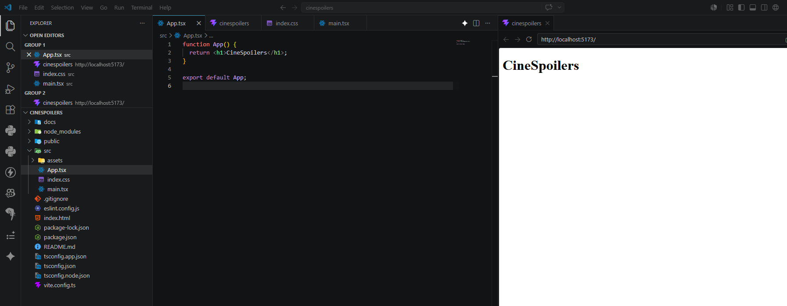
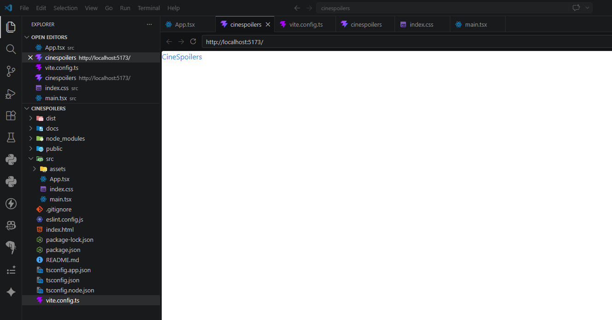
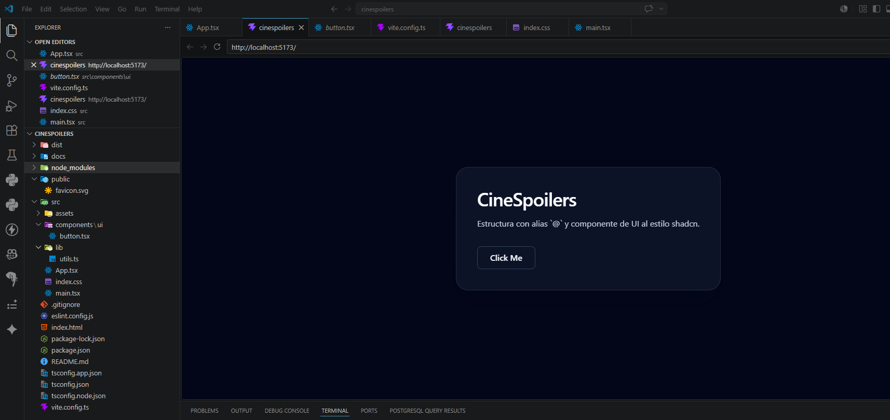
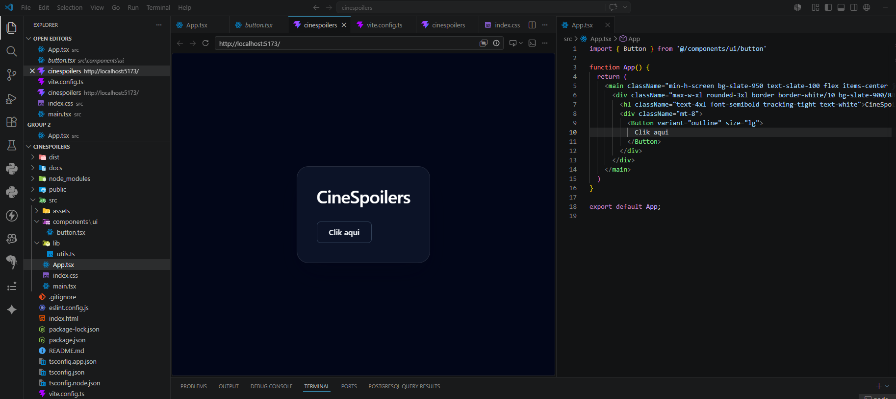
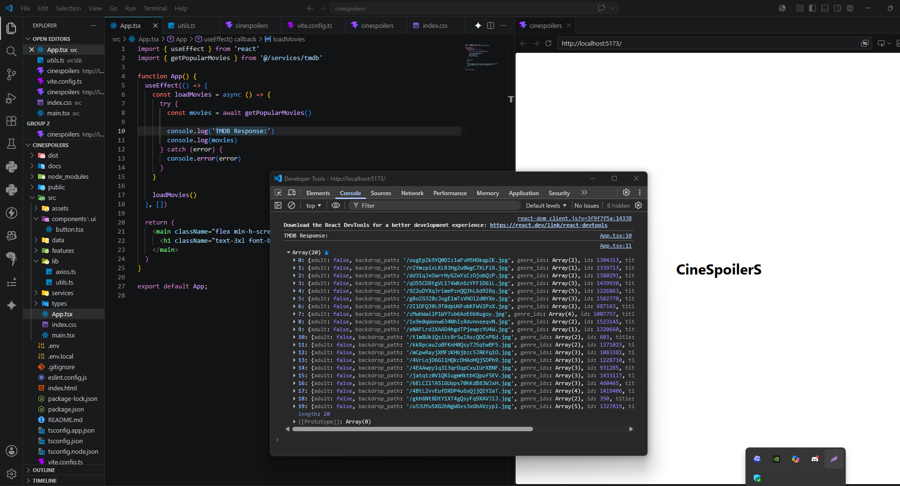
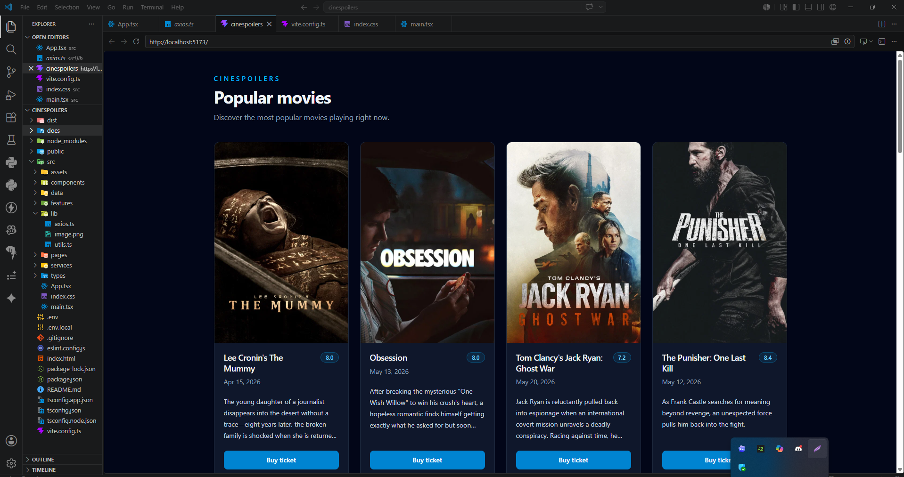
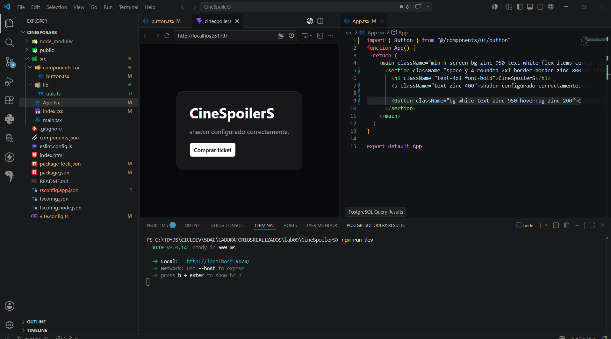
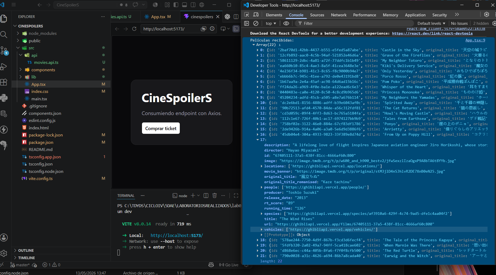

##### EVIDENCIAS LUIS DIONICIO - LAB 11:
#### 1- Consumir endpoinst y renderizar información - #### Crear proyecto

#### 2-Limpiar proyecto

#### 3-Instalar tailwind 

#### 4- Configurar alias - -Instalar shadcn

#### 5Configurar shadcn - Feching de datos

#### 6- Instalar y configurar axios -Mostrar por consola

###### 7- Renderizado de información

##### EVIDENCIAS JERONIMO ORTIZ

# EVIDENCIAS DE LABORATORIO 11 PARA CONSUMO DE ENDPOINTS Y RENDERIZANDO INFORMACIÓN

### 1. Creando proyecto

### 2. Proyecto Limpio

### 3-Instalando Tailwind

### 4. Configurando Alias para proceder a Instalar shadcn

### 5. Configurar shadcn - Feching de datos

### 6. Instalar y configurar axios -Mostrar por consola

#### 7. Renderizado de información
FORMATO JSON UTILIZADO PARA CONSUMIR POR LA API: https://ghibliapi.vercel.app/films

##### EVIDENCIAS Jose Sotelo

# Evidencias Lab 11 - Sotelo

---

## 1. Consumir endpoints y renderizar información - Crear proyecto

---

## 2. Limpiar proyecto

---

## 3. Instalar Tailwind - Instalar shadcn

---

## 4. Configurar alias

---

## 5. Configurar shadcn - Fetching de datos

---

## 6. Instalar y configurar Axios - Mostrar por consola

---

## 7. Renderizado de información

