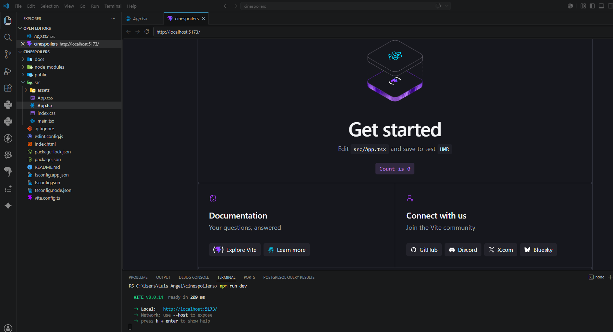
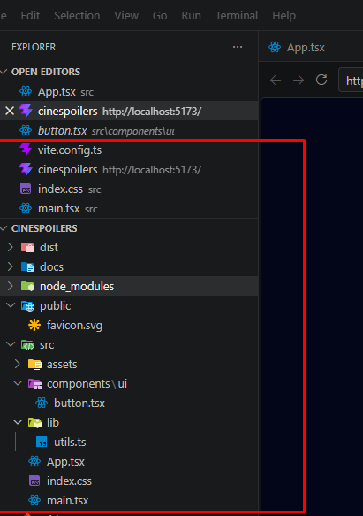

#### 1- Consumir endpoinst y renderizar información - #### Crear proyecto

#### 2-Limpiar proyecto

#### 3-Instalar tailwind 

#### 4- Configurar alias - -Instalar shadcn

#### 5Configurar shadcn - Feching de datos

#### 6- Instalar y configurar axios -Mostrar por consola

###### 7- Renderizado de información

