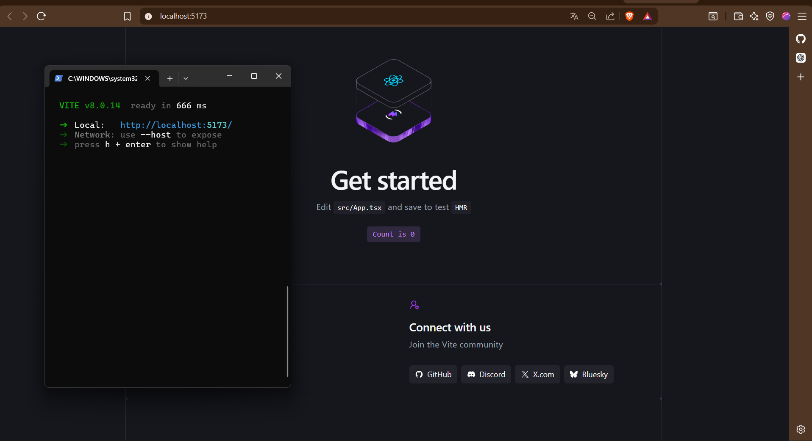
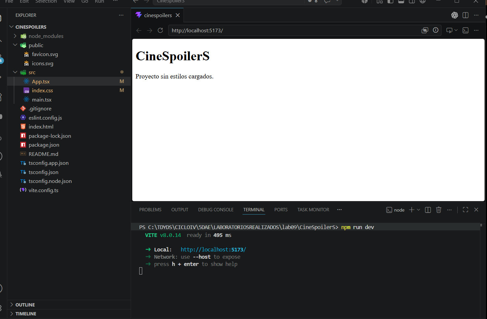
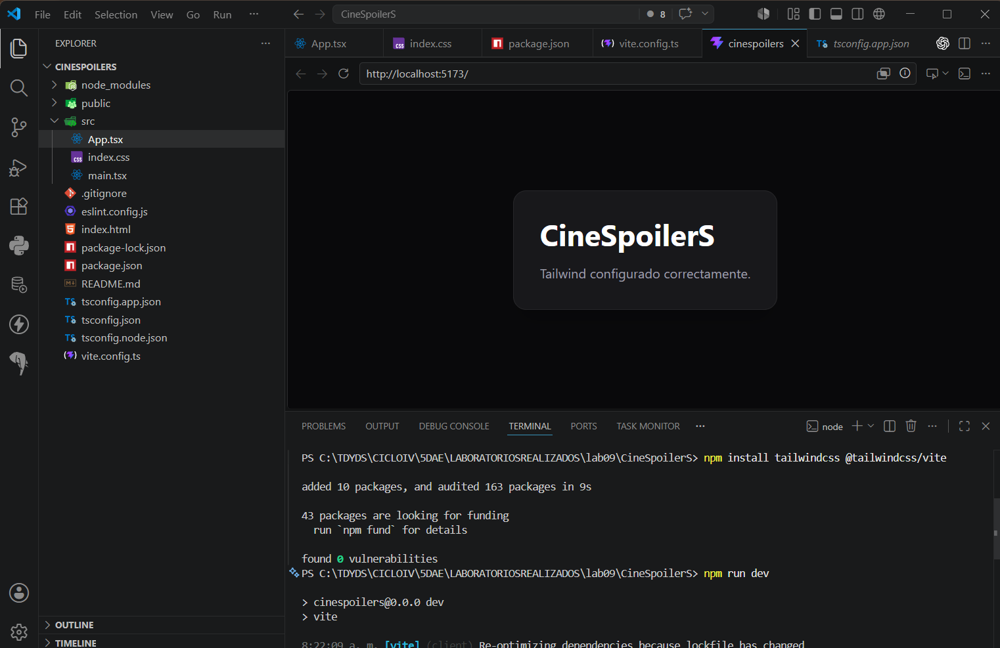
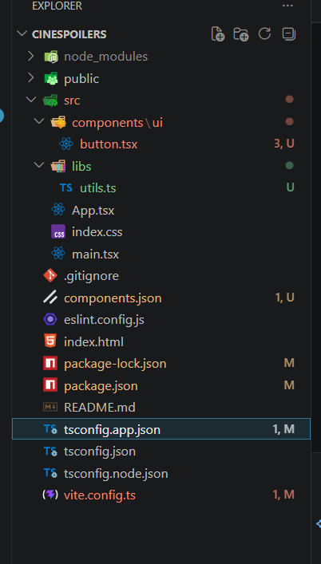
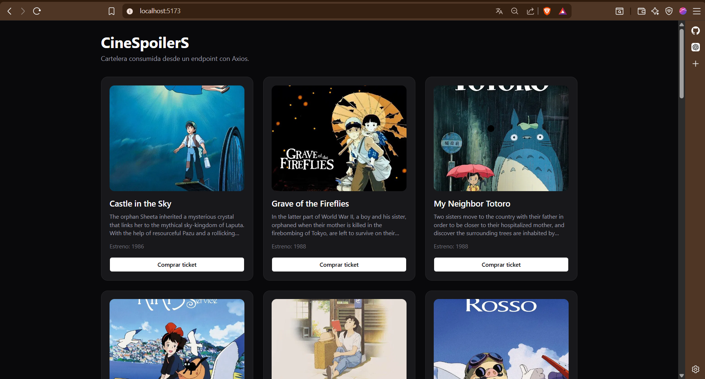

# EVIDENCIAS DE LABORATORIO 09 PARA CONSUMO DE ENDPOINTS Y RENDERIZANDO INFORMACIÓN

### 1. Creando proyecto

### 2. Proyecto Limpio

### 3-Instalando Tailwind

### 4. Configurando Alias para proceder a Instalar shadcn

### 5. Configurar shadcn - Feching de datos

### 6. Instalar y configurar axios -Mostrar por consola

#### 7. Renderizado de información
FORMATO JSON UTILIZADO PARA CONSUMIR POR LA API: https://ghibliapi.vercel.app/films

